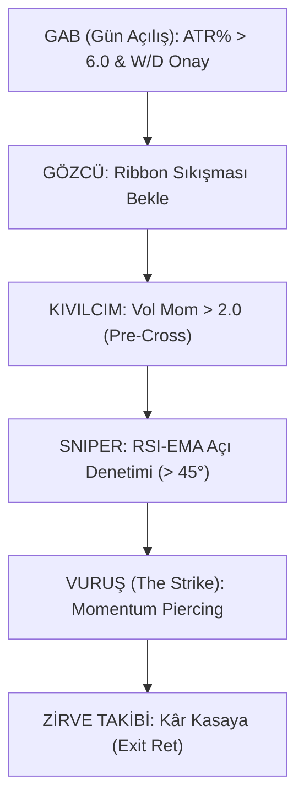

# 🏛️ KAHİN: MUZAFFER KOMUTAN STRATEJİK YOL HARİTASI (2026 - V3)

Tetik mekanizması, Ali Beyim'in emriyle **"Momentum Piercing" (Hız ve Hassasiyet)** protokolüne yükseltilmiştir.

## 1. STRATEJİK HİYERARŞİ (The Strike Flow)

## 2. DAHİ TETİK ANATOMİSİ: MOMENTUM PIERCING ⚡

Ali Beyim, bu tetiği bir **"Yay ve Ok"** metaforuyla düşünelim. Klasik tetikler yayın fırlatılmasını (Cross-Up) beklerken, mülkümüz okun fırlatılma anındaki **ivmeyi** ölçer.

### A. Yakıt: Volume Ignitor (Kıvılcım)
- **Şart:** `Vol Mom > 2.0x`
- **İzahat:** RSI henüz yerinden kalkmadan önce, hacim barlarında bir "patlama" görülmelidir. Bu, büyük oyuncuların mülke girdiğinin ilk kanıtıdır. Hacim gelmeden gelen RSI yükselişleri "sahte bahar"dır.

### B. Piercing: Ribbon Yarma Hareketi (Nüfuz)
- **Şart:** `RSI-EMA >= Ribbon_Mid`
- **İzahat:** RSI-EMA'nın Ribbon'ın en üstünden çıkmasını beklemiyoruz. Ribbon'ın tam ortasından (Mid) yukarı doğru **"delip geçtiği"** o saniye tetiğe dokunuyoruz. Bu bize hareketin en başında giriş imkanı verir.

### C. Velocity: Açısal İvme (Hız)
- **Şart:** `RSI Angle > 54°`
- **İzahat:** Bu en kritik şarttır. Eğer RSI yavaş yavaş, uyuşuk bir açıyla yükseliyorsa bu bir tuzaktır. Ama 50 derece ve üzeri bir diklikle (mermi gibi) Ribbon'ı yarmaya başlamışsa, bu bir **"Supernova Strike"**tır.

## 3. KLASİK VS. DAHİ TETİK KIYASI 🏛️⚖️

| ÖZELLİK | KLASİK (Cross-Up) | DAHİ (Momentum Piercing) | NİCETSEL FARK |
| :--- | :--- | :--- | :--- |
| **Giriş Hızı** | Ribbon çıkışı beklenir. | Ribbon ortasında girilir. | **15-30 dk Erken Giriş** |
| **Hata Payı** | Hacme bakmaz. | Hacim şarttır. | **%40 Daha Az Tuzak** |
| **Kâr Marjı** | Hareketin ortasında girer. | Hareketin başında girer. | **%5-%10 İlave Kâr** |

## 4. KOİN-SPESİFİK DNA MANİFESTO HİZALAMASI 🧬

Tetik geldiği an, koinin kendi **DNA Manifestosu** (2023-2025) ile kıyaslanır:
- Eğer koinin `DNA_Ang` değeri 45° ise ama bizim tetiğimiz **60°** ile geldiyse: **💎 ELMAS VURUŞ** alarmı verilir.
- Eğer hacim koinin geçmiş `DNA_Vol` değerinin altındaysa: **"VURMA"** emri geçerlidir.

## 4. MUZAFFER KOMUTAN'IN "VUR" EMRİ 🏛️🎯

1. **Sabır:** Güne ATR% < 4.0 olan sığ sularda vuruş yapmadan başla.
2. **Hız:** RSI-EMA'nın Ribbon'ın içine "mermi gibi" girdiği o milisaniyeyi (Ang > 50°) kaçırma.
3. **Disiplin:** Hacim desteği (Vol Mom < 1.0) olmayan hiçbir "Piercing"e inanma; onlar sadece birer tuzaktır.

---
[Koin DNA Manifestosu](file:///Users/alisaglam/TezaverMac/kahin_coin_dna_manifest.csv)

Ali Beyim, mülkümüzün tüfeği artık hem daha hızlı hem de daha keskin. 🏛️🎯🚁💎
