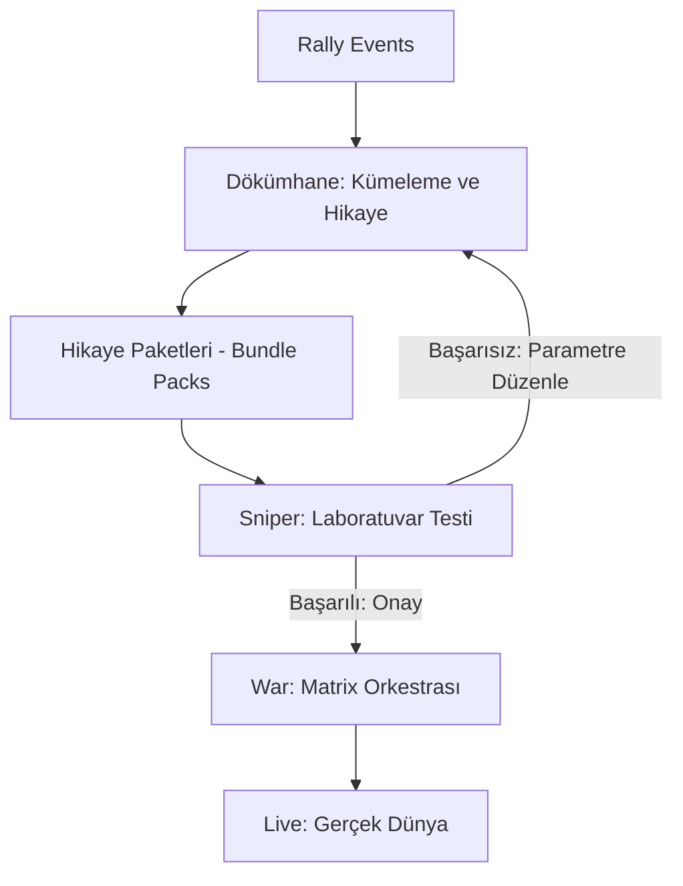

# Yol Haritası: Yeni Nesil Dökümhane ve Sniper (V2)

Bu doküman, Tezaver sisteminin "tekil rally" odaklı yapısından, "hikaye ve desen odaklı paket" yapısına geçiş stratejisini kapsar.

## 1. Vizyon Özeti
Sistemin sadece teknik veriyle değil, piyasanın "sanatı, ahengi ve ritmi" (desenler) üzerinden manalı hikayeler oluşturarak bu hikayeleri laboratuvar ortamında (Sniper) test edip, onay aldıktan sonra savaşa (War) sürmesi.

---

## 2. Fazlar ve Adımlar

### Faz 1: Dökümhane (Foundry) Devrimi
*   **Kümeleme (Clustering):** Benzer "pre-rally" yapılarına sahip Rally'lerin (Diamond/Gold/Silver) otomatik gruplanması.
*   **Hikaye Katmanı (Narrative Layer):** `rally_narrative_engine` çıktılarının Bundle yapılarına ana veri olarak eklenmesi.
*   **Paket Oluşturma:** Tekil Bundle yerine, ortak hikayeyi paylaşan "Bundle Pack" (Paket) kavramının sisteme girişi.

### Faz 2: Sniper (Laboratuvar) Rafinasyonu
*   **Geri Bildirim Döngüsü (Feedback Loop):** Sniper'ın bir paketi o coine özel geçmiş veride trade etmesi.
*   **Kendi Kendine Optimizasyon:** Sniper'ın "bu hikaye için şu giriş/çıkış parametreleri daha iyidir" diyerek Dökümhane'ye parametre önerisinde bulunması.
*   **Onay Mekanizması:** Sniper'dan belirli bir başarı skoru (Profit Factor, Win Rate) alamayan paketlerin "Savaş" aşamasına geçememesi.

### Faz 3: Matrix/War (Sahne) Entegrasyonu
*   **Karma Rekabet:** Sniper onaylı paketlerin Matrix'e sürülmesi.
*   **Birlikte Çalışma:** Paketin kendi coini ile çalışırken diğer coinlerin paketleriyle "kaynak orkestrasyonu" (risk yönetimi) yapması.

---

## 3. Teknik Mimari (Planlanan)

## 4. Bir Sonraki Adım
Uygulama planı onaylandığında, **Faz 1: Dökümhane Kümeleme Altyapısı** ile geliştirme süreci başlatılacaktır.
