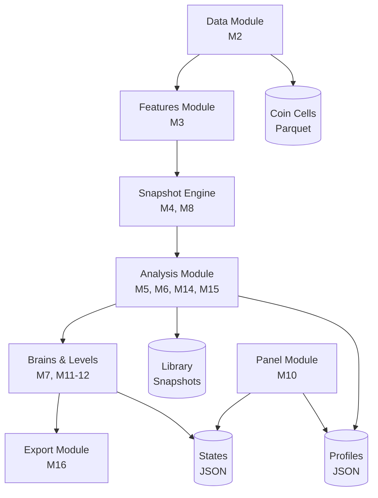

# Tezaver-Mac Architecture

## 📋 Sistem Genel Bakış

Tezaver-Mac, kripto para teknik analizi için geliştirilmiş 4 katmanlı offline bir analiz sistemidir. Sistem, veri toplama, özellik çıkarımı, analiz ve sunum katmanlarından oluşur.

## 🏗️ Mimari Diyagramı



## 📦 Modül Sorumlulukları

### Katman 1: Data Module (M2)
**Amaç**: Ham OHLCV veri toplama

- **Kaynak**: Binance (CCXT üzerinden)
- **Zaman Dilimleri**: 15m, 1h, 4h, 1d, 1w
- **Çıktı**: Parquet dosyaları (`coin_cells/`)
- **Teknoloji**: CCXT, Pandas, PyArrow

```python
# Örnek kullanım
from tezaver.data.run_history_update import main
main()  # Tüm coinler için veri güncellenir
```

### Katman 2: Features Module (M3)
**Amaç**: Teknik indikatör hesaplama

- **İndikatörler**: EMA, Bollinger Bands, MACD, RSI, ATR
- **Girdi**: Ham OHLCV verileri
- **Çıktı**: Zenginleştirilmiş parquet (indicators eklenmiş)

**Hesaplanan İndikatörler:**
- `ema_9`, `ema_21`, `ema_50`: Exponential Moving Averages
- `bb_upper`, `bb_middle`, `bb_lower`: Bollinger Bands
- `macd`, `macd_signal`, `macd_hist`: MACD
- `rsi`: Relative Strength Index
- `atr`: Average True Range

### Katman 3: Analysis Module (M4-M15)

#### M4: Snapshot Engine
Pattern yakalama ve snapshot oluşturma

```python
# Snapshot yapısı
{
    "timestamp": "2024-12-05 18:00:00",
    "trigger": "bullish_cross",
    "close": 42000.5,
    "volume_rel": 1.5,
    "rsi": 55.2
}
```

#### M5: Rally Labeler
Gelecekteki kazançları etiketleme

- **Eşikler**: %5, %10, %20
- **Lookahead**: Timeframe bazlı (config.py)
- **Çıktı**: `rally_label` ("5p", "10p", "20p", "none")

#### M6: Pattern Wisdom
Güvenilir/ihanetkâr pattern tespiti

- **Trust Score**: Hit rate bazlı güven skoru
- **Minimum Örnekler**: 20 (configurable)
- **Çıktı**: `pattern_stats.json`, `trustworthy_patterns.json`

#### M14: Rally Families
KMeans ile rally kümeleme

- **Özellikler**: Volume, RSI, ATR, slope
- **Küme Sayısı**: 3-5 (adaptive)
- **Çıktı**: `rally_families_{timeframe}.json`

#### M15: Regime & Shock
Piyasa rejimi ve şok tespiti

- **Rejim Tipleri**: bull, bear, sideways
- **Shock Detection**: ATR spike + volume surge
- **Çıktı**: `regime_shock.json`

### Katman 4: Presentation Module (M10)
**Teknoloji**: Streamlit

**Sayfalar:**
1. **Ana Sayfa**: Günlük özet, top coinler
2. **Piyasa Özeti**: Tüm coinlerin karşılaştırmalı tablosu
3. **Coin Detay**: 7 sekme ile detaylı analiz

## 📊 Veri Akışı

```
Binance API
    ↓
[M2] History Update → coin_cells/{SYMBOL}_{TF}.parquet
    ↓
[M3] Feature Build → coin_cells/{SYMBOL}_{TF}_features.parquet
    ↓
[M4] Snapshot Build → library/{SYMBOL}_{TF}/events.parquet
    ↓
[M5] Rally Labeler → library/{SYMBOL}_{TF}/labeled_events.parquet
    ↓
[M6] Pattern Wisdom → data/coin_profiles/{SYMBOL}/pattern_stats.json
    ↓
[M14] Rally Families → data/coin_profiles/{SYMBOL}/rally_families_{TF}.json
    ↓
[M15] Regime & Shock → data/coin_profiles/{SYMBOL}/regime_shock.json
    ↓
[M7] Brain Sync → data/coin_states/{SYMBOL}.json
    ↓
[M16] Bulut Export → data/coin_states/{SYMBOL}_export.json
    ↓
[M10] Panel UI (Streamlit)
```

## 🗂️ Dizin Yapısı Detayları

```
TezaverMac/
├── src/tezaver/
│   ├── core/           # Temel yapılar
│   │   ├── config.py   # Merkezi konfigürasyon
│   │   ├── models.py   # Pydantic modelleri
│   │   └── state_store.py
│   ├── data/           # Veri toplama
│   │   └── run_history_update.py
│   ├── features/       # İndikatör hesaplama
│   │   ├── indicator_engine.py
│   │   └── run_feature_build.py
│   ├── snapshots/      # Pattern snapshot
│   │   ├── snapshot_engine.py
│   │   └── run_snapshot_build.py
│   ├── outcomes/       # Rally etiketleme
│   │   └── rally_labeler.py
│   ├── rally/          # Rally analiz
│   │   └── run_rally_families.py
│   ├── wisdom/         # Pattern bilgeliği
│   │   └── pattern_stats.py
│   ├── brains/         # Regime & shock
│   │   └── regime_shock_engine.py
│   ├── levels/         # Seviye tespiti
│   ├── export/         # Bulut export
│   └── ui/             # Streamlit panel
│       ├── main_panel.py
│       ├── dataframe_configs.py  # Reusable configs
│       └── i18n_tr.py
├── coin_cells/         # Parquet veri hücreleri
├── library/            # Snapshot kütüphanesi
├── data/
│   ├── coin_profiles/  # Coin profilleri (JSON)
│   ├── coin_states/    # CoinState'ler
│   └── wisdom/         # Global bilgelik
├── backups/            # Yedekler
└── tests/              # Test dosyaları
```

## 🎯 Tasarım Kararları

### Neden Parquet?
1. **Sıkıştırma**: CSV'ye göre 10x daha küçük
2. **Performans**: Columnar format, hızlı column reads
3. **Schema**: Tip korunması, parsing hatası yok
4. **Ecosystem**: Pandas, PyArrow native desteği

### Neden Offline Processing?
1. **Maliyet**: Real-time API maliyeti yok
2. **Analiz**: Complex backtesting için historical data gerekli
3. **Güvenilirlik**: API rate limit sorunu yok
4. **Kontrol**: Veri kalitesi üzerinde tam kontrol

### Neden Streamlit?
1. **Hız**: Rapid prototyping
2. **Python-native**: JavaScript bilgisi gereksiz
3. **Interaktif**: Built-in widgets
4. **Deployment**: Kolay cloud deployment

### Neden JSON State Files?
1. **Okunabilirlik**: Human-readable
2. **Portability**: Language-agnostic
3. **Git-friendly**: Diff'leri takip edilebilir
4. **Schema-free**: Esnek yapı

## 🔧 Temel Sınıflar

### CoinState
```python
@dataclass
class CoinState:
    """Merkezi coin durumu."""
    symbol: str
    last_update: datetime
    wisdom: Dict  # Pattern wisdom
    rally_families: Dict
    regime_shock: Dict
    levels: Dict
    risk_score: float
```

### PatternSnapshot
```python
@dataclass
class PatternSnapshot:
    """Tek bir pattern snapshot'ı."""
    timestamp: datetime
    trigger: str
    price: float
    volume: float
    indicators: Dict[str, float]
```

## 📈 Pipeline Akışı

### Full Pipeline (10-15 dakika)
```bash
M2  → M3  → M4  → M8  → M5  → M14 → M6 → M15 → M18 → M11 → M7 → M16 → M13
└─┬─┘ └┬┘  └┬┘  └─┬─┘ └┬┘  └─┬─┘ └┬┘ └─┬─┘ └─┬─┘ └─┬┘ └┬┘ └─┬─┘ └─┬┘
  │    │    │     │    │     │    │    │     │     │   │    │     │
Data Feat Snap Multi Rally Rally Patt Regime Glob Lvl Brain Exp Backup
```

### Fast Pipeline (1-2 dakika)
```bash
M7 → M16
└┬┘  └┬┘
Brain Export
```

## 🚀 Genişleme Noktaları

### Yeni İndikatör Ekleme
```python
# features/indicator_engine.py
def add_custom_indicator(df: pd.DataFrame) -> pd.DataFrame:
    """Yeni indikatör ekle."""
    df['my_indicator'] = calculate_my_indicator(df)
    return df
```

### Yeni Trigger Türü
```python
# snapshots/snapshot_engine.py
def detect_custom_trigger(df: pd.DataFrame, i: int) -> bool:
    """Özel trigger tespit."""
    return (df['ema_9'].iloc[i] > df['ema_21'].iloc[i] and
            df['rsi'].iloc[i] > 50)
```

## 🔐 Güvenlik

### API Key Yönetimi
- **Konum**: `.env` dosyası (git'e eklenMEZ)
- **Yükleme**: `python-dotenv` ile otomatik
- **Access**: `from tezaver.core.config import BINANCE_API_KEY`

### Veri Güvenliği
- Tüm veriler local'de
- Bulut export isteğe bağlı
- Hassas data şifrelenmeli (TODO)

## 📊 Performans Özellikleri

### Caching Stratejisi
```python
@st.cache_data(ttl=600)  # 10 dakika cache
def load_heavy_data(symbol: str):
    # Ağır data yükleme
    pass
```

### Optimization Points
1. **Parquet Chunking**: Büyük dosyalar için
2. **Lazy Loading**: Sadece görünen data yüklenir
3. **Index Optimization**: Timestamp indexing
4. **Memory Management**: Gereksiz references temizle

## 🧪 Test Stratejisi

### Unit Tests
- İndikatör hesaplamaları
- Rally tespiti
- Pattern classification

### Integration Tests
- Pipeline end-to-end
- Veri kalitesi
- State synchronization

### UI Tests
- Streamlit components
- i18n completeness
- Chart rendering

## 🔄 Future Enhancements

### Kısa Vadeli
- [ ] Real-time mode (WebSocket)
- [ ] Alert sistemi
- [ ] Mobile notifications

### Orta Vadeli
- [ ] Cloud sync otomasyonu
- [ ] Multi-exchange support
- [ ] Advanced backtesting

### Uzun Vadeli
- [ ] Machine learning models
- [ ] Sentiment analysis
- [ ] Social media integration
- [ ] Mobile app (React Native)

---

**Son Güncelleme**: Aralık 2025  
**Versiyon**: 2.0  
**Yazar**: Tezaver Mac Development Team
