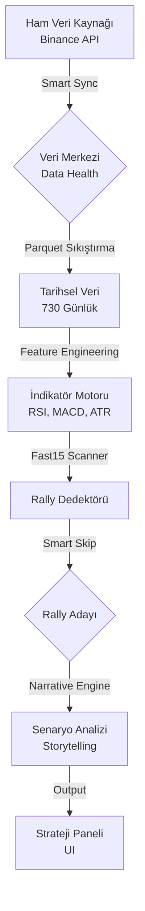
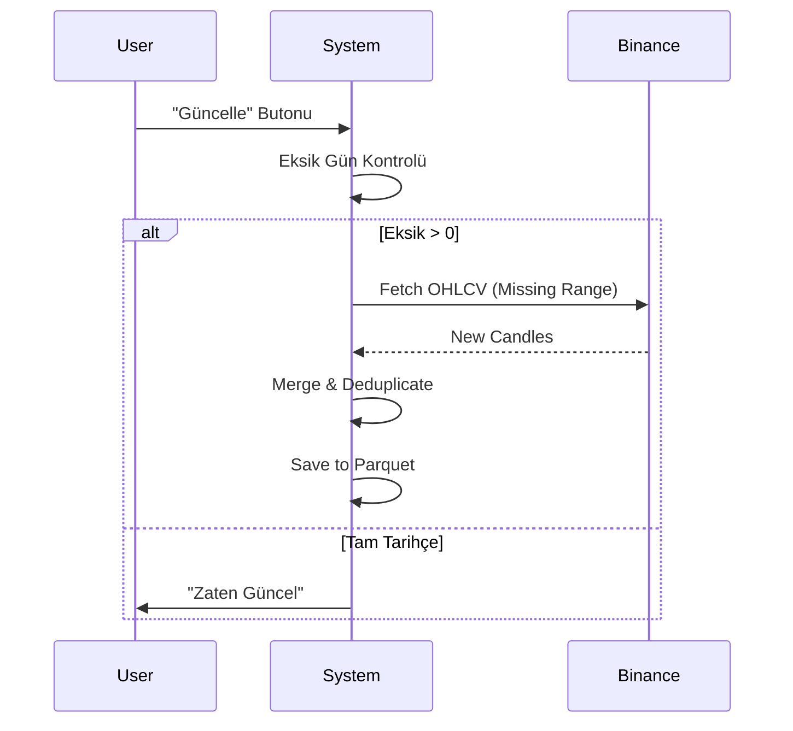

# Tezaver Mac - Detaylı Kullanım ve Teknik Kılavuz (vM12)

*(Temsili Sistem Görseli)*

Bu doküman, **Tezaver Mac** ekosisteminin veri işleme, analiz ve karar verme mekanizmalarını en ince detayına kadar açıklar.

---

## 🏗️ 1. Sistem Mimarisi ve Veri Akışı

Tezaver, lineer bir işlem hattı (pipeline) üzerinde çalışır. Veri girer, işlenir, anlamlandırılır ve stratejiye dönüşür.

---

## 💾 2. Veri Merkezi (Data Module)

### 2.1 Akıllı Senkronizasyon (Smart Sync)
Sistem veriyi körü körüne indirmez. Her coin için bir "Veri Sağlığı Karnesi" tutar.

*   **Derinlik:** Hedef 730 gündür (2 Yıl).
*   **Onarım (Self-Healing):** Eğer bir coin'in sadece son 30 günü varsa, sistem bunu fark eder ve "Shallow History Repair" devreye girerek eksik olan geçmiş 2 yılı tamamlar.
*   **Artımlı Güncelleme (Incremental):** Sadece son güncellemeden bugüne kadar olan eksik dakikaları indirir.

---

## 🚀 3. Ani Yükseliş Taraması (Fast15 Scanner)

Sistemin en kritik parçasıdır. 15 dakikalık grafikteki ani patlamaları (Pump) yakalar.

### 3.1 Rally Tespiti (Detection)
Bir hareketin "Rally" sayılması için şu formül kullanılır:
$$ \text{Gain} = \frac{\text{MaxHigh}_{(t+1 \dots t+21)} - \text{Close}_t}{\text{Close}_t} $$

*   **Close(t):** Sinyal anındaki kapanış fiyatı.
*   **MaxHigh(t...21):** Önümüzdeki 21 bar (5.25 saat) içindeki en yüksek fiyat.
*   **Eşik:** Eğer Gain >= %5 ise sinyal üretilir.

### 3.2 Akıllı Zıplama (Smart Skip)
Sistem aynı yükseliş için birden fazla sinyal üretmemek için "Smart Skip" algoritmasını kullanır.

*   **Sorun:** Fiyat 10 bar boyunca yükseliyorsa, eski sistem 10 tane "AL" sinyali üretiyordu.
*   **Çözüm:** Sistem bir rally bulduğunda, o rally'nin **Zirve Noktasına (Peak)** kadar olan süreyi hesaplar ve tarayıcıyı o noktaya kadar ileri sarar.
*   **Fayda:** Her yükseliş dalgası için sadece **tek ve en dipteki** giriş sinyali kaydedilir.

---

## 🎬 4. Hikaye Motoru (Narrative Engine)

Sistem bir rally bulduğunda, sadece "Buldum" demez. Ona bir **kimlik (Senaryo)** verir.

Bunun için çoklu zaman dilimi (Multi-Timeframe Context) kullanılır:

| Senaryo | Etiket | Koşullar | Risk |
| :--- | :--- | :--- | :--- |
| **Güç Patlaması** 💥 | `SCENARIO_POWER_PUMP` | 1G Nötr, **15dk RSI > 70**, Hacim Patlaması | Düşük |
| **Fırtınada Sörf** 🏄‍♂️ | `SCENARIO_SURF` | **1G Ayı**, 4S Aşırı Satım, 15dk Tepki | Yüksek |
| **Rüzgarı Arkana Al** 🌬️ | `SCENARIO_BREAKOUT` | **1G Boğa**, **4S Boğa**, 15dk kırılım | En Düşük |
| **Yorgun Savaşçı** 🥵 | `SCENARIO_EXHAUSTION` | **1G Aşırı Alım (>70)**, RSI Uyuşmazlığı | Orta |
| **Belirsiz Sular** 🌊 | `SCENARIO_NEUTRAL` | Net bir kalıba uymayan hareketler | Yüksek |

> **İstatistik:** Yapılan testlerde "Güç Patlaması" senaryosunun kazanma oranı, "Belirsiz Sular"a göre **7.5 kat daha yüksektir**.

---

## 📊 5. İndikatör Hesaplamaları

### A. RSI (Relative Strength Index)
$$ RSI = 100 - \frac{100}{1 + RS} $$
*   **RS:** Ortalama Kazanç / Ortalama Kayıp (Son 14 periyot).
*   **Yorum:** 70 üstü "Aşırı Alım" (Pahalı), 30 altı "Aşırı Satım" (Ucuz).

### B. MACD (Moving Average Convergence Divergence)
Trendin yönünü ve gücünü ölçer.
1.  **MACD Line:** 12 periyotluk EMA - 26 periyotluk EMA.
2.  **Signal Line:** MACD Line'ın 9 periyotluk EMA'sı.
3.  **Histogram:** MACD Line - Signal Line.

### C. Güven Skoru (Trust Score)
Yapay Zeka'nın "Bu sinyale ne kadar güveniyorum?" cevabıdır (0-100 Puan).
$$ \text{Score} = ( \text{WinRate} \times 0.6 ) + ( \frac{\text{AvgGain}}{\text{AvgLoss}} \times 0.4 ) $$

---

## 🧪 6. Laboratuvarlar (Labs)

Panelin üst kısmındaki sekmeler farklı "Deney Alanlarıdır".

### A. Fast-15 (Scalp Lab)
*   **Odak:** Hız.
*   **Veri:** Sadece son 24 saati ve 15 dakikalık periyodu baz alır.
*   **Kullanım:** Gün içi "Vur-Kaç" işlemleri için.

### B. Time-Labs (Trend Lab)
*   **Odak:** Yön.
*   **Veri:** Haftalık ve Aylık yapıyı inceler.
*   **Kullanım:** "Trendin tersine işlem açma" kuralını uygular.

---

## ❓ Sıkça Sorulan Sorular (SSS)

**S: Grafiklerdeki saatler yanlış mı?**
C: Hayır, grafikler varsayılan olarak UTC (Dünya Saati) ile gelir ancak Tezaver Mac **otomatik +3 Saat** ekleyerek Türkiye saatine çevirir.

**S: Neden bazı coinlerde "Yorgun Savaşçı" uyarısı var?**
C: O coin günlük grafikte çok şişmiş demektir (RSI > 70). Buradan gelecek bir yükseliş kısa ömürlü olabilir, sistem sizi uyarıyor.

**S: MATIC verileri neden gelmiyor?**
C: MATIC artık POL oldu. Sistem otomatik olarak POL verisine geçti. Eğer eski veri görüyorsanız "Veri Merkezi"nden "Kullanılmayanları Temizle" diyebilirsiniz.

---
*Doküman Sürümü: vM12 (Narrative Engine Update)*
